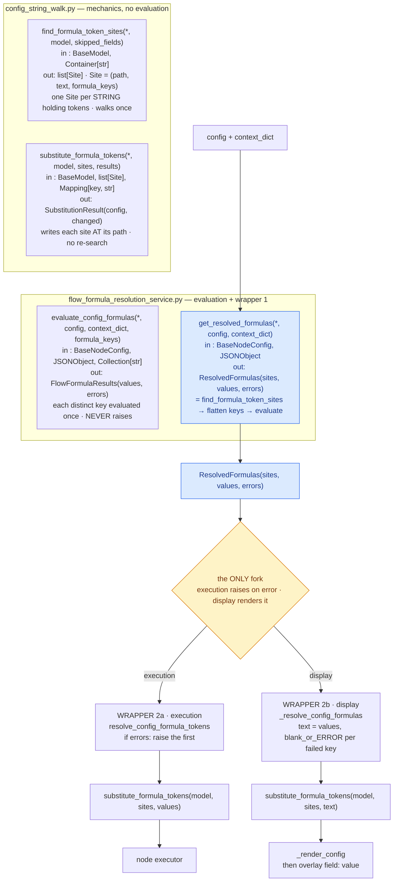
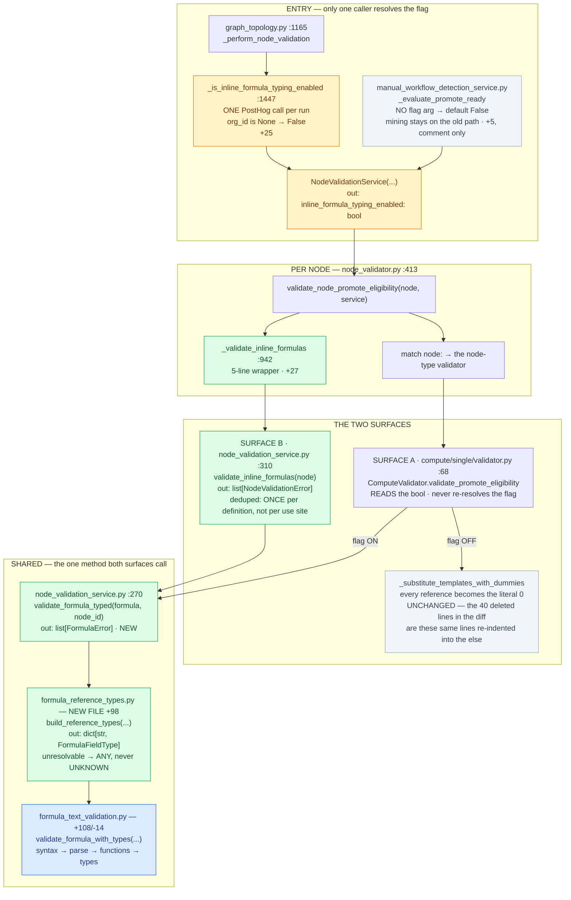

# Reference — the shapes

The worked examples the two `make-diagram` grammars were derived from. Match these.

Both are real cases, and both were drawn because prose had already failed at the same job.

---

# 1. Pipeline with a fork

Source: the CRMF-2202 formula-token-rendering design. Two consumers (execution and display)
share one resolution path and diverge at exactly one point. Prose about it was unreadable; the
drawing made it obvious at a glance. That gap is why the skill exists.

Use it when the question is **"where do the consumers diverge"**.

## What each element buys

Every one of these is load-bearing, not decoration.

| Element | What it buys |
|---|---|
| `subgraph "file.py — role"` | Names the module **and its boundary**. "mechanics, no evaluation" tells you what the file refuses to do — usually the more useful half. |
| `in :` / `out:` inside the node | The reader never scrolls to a signature list. The single biggest win over a bulleted function list. |
| A type alias inline (`Site = (path, text, formula_keys)`) | Expands the shape at the point of use instead of in a separate legend. |
| One logic line per function | Forces the essential clause out. Two lines means you haven't decided what matters. |
| The value on the wire as its own node (`ResolvedFormulas(...)`) | Makes the flow readable without re-reading the modules above. |
| `{"the ONLY fork"}` as a diamond, styled | **The point of the whole drawing.** A falsifiable claim: exactly one divergence. If a reviewer knows of a second, the diagram is wrong and they'll say so — which is the diagram earning its keep. |
| Edge labels `execution` / `display` | Names *what* forks, not merely that something does. |
| Identical `substitute_formula_tokens(...)` on both branches | Duplication drawn honestly. Both branches call the same function with a different mapping — visible instantly, invisible in prose. |
| Branch B continuing past its terminal | Branches don't have to be symmetric. Draw the real lengths. |

**The one thing to copy above all:** the fork node. A two-consumer pipeline has exactly one
interesting fact — *where* the consumers diverge — and every other format buries it. Give it its
own node, colour it, and say the count in the walkthrough.

---

# 2. Call-chain spine

Source: explaining CRMF-2317 / PR #32637 to its own author. The ask was *"one viz for all the
files in their calling order"* — the diff was unreadable because 40 of its "deleted" lines were
the old code re-indented into an `else:`.

Use it when the question is **"what calls what, across these files, in order"** — a PR
walkthrough, or tracing an entry point to its leaf.

## What each element buys

| Element | What it buys |
|---|---|
| `subgraph "PHASE — file.py :LINE"` | The phase is the reader's spine; the `file:line` is what makes every claim checkable. Neither works alone — a phase with no location is a vibe, a location with no phase is a stack trace. |
| Diff stat on every file (`+27`, `+108/-14`, `NEW FILE +98`) | Turns a call chain into a *PR* explanation. Shows at a glance which files are wiring and which hold the change. |
| Naming re-indentation explicitly | The single most useful line in the source case — it dissolved the author's impression that logic had been migrated out of a file when nothing had moved. |
| `untouched` class on the flag-off branch | A flag-gated PR has a whole column that is today's behaviour. Saying so is what makes the other column readable as *the change*. |
| Two entry points drawn side by side | The asymmetry — one caller resolves the flag, one leaves it at its default — was the most load-bearing fact in the PR, and it appeared nowhere in the diff *as* a diff. |
| Edge labels `flag OFF` / `flag ON` | The fork, in a shape that has no single fork node. |

## What this shape loses to auto-layout — say it in the walkthrough

In the source case Surface B's call travels *past* the Surface A block to reach the shared
section: they are at different depths of one traversal, not siblings. Mermaid draws them as
siblings and there is no idiom that fixes it. **That is not a reason to avoid the shape** — it's
a reason the walkthrough must carry the sentence the picture can't.

Same for anything living in a margin rather than a node: cross-references, "this is the only
non-additive change", counts. Put them in the walkthrough.

## Traps

- **Don't invent the phases.** They must be real boundaries in the call chain, not a narrative
  imposed on it. If a section title doesn't correspond to a function actually being entered,
  it's decoration.
- **A long node label is fine; a long node label doing two jobs is not.** Contract, then one
  logic line, then the diff stat. If you need a fourth line, you're explaining rather than
  drawing — move it to the walkthrough.
